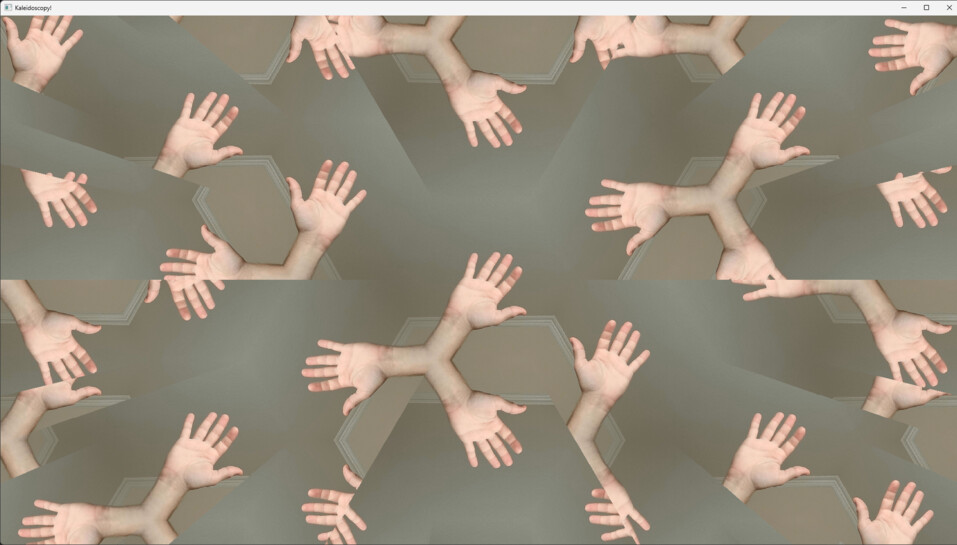
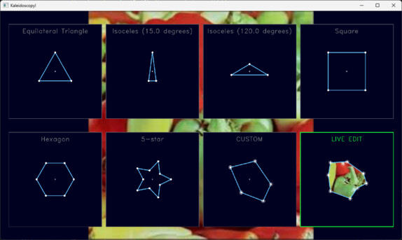
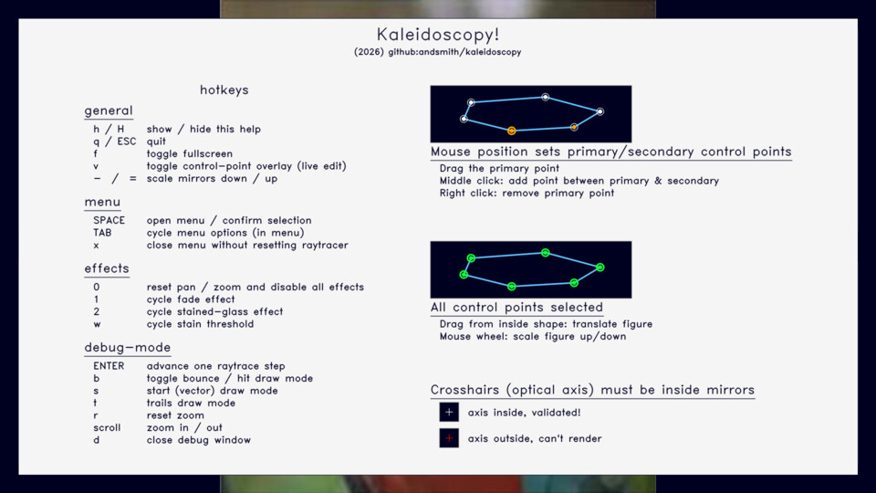

# kaleidoscopy - (n) the use of a kaleidoscope

(cf. *microscopy*, *spectroscopy*, etc.)

Define a kaleidoscope as 2-valued function of 2 variables K(i,j), mapping screen coordinates (i.e. pixel locations) to their origin in the source image, assuming they bounced around in a kaleidoscope with a given geometry.  If that sounds like raytracing, it is, but the key insight for this project is we only need to compute this once, in the beginning. To display any arbitrary image or video through the kaleidoscope just takes look-ups.  Kaleidoscopy works in these 2 parts:

 * **raytracing**:  Vectorized as possible with numpy, given mirror and 3d scene geometry, compute:
   * the Kaleidoscope mapping K(i,j) = (x,y), via raytracing in the usual way but recording the target pixel xy coordinate instead of its color. 
   * the bounce map B(i,j) = n, where the output pixel at location i, n bounced off n mirrors before reaching the image plane.
 * **mapping** (viewing):  Using a numpy c extension (remap_img.c) this is straightforward:
   * Given the kaleidscope and bounce maps and an input image, compute the output image with simple look-ups.

This means it can run live on a webcam:

Run: `> python scope.py` to start the app with the webcam, or `> python scope.py <input_image>` to start the app with a specific input image.  Run with `--help` for to see options for input/output resolution.  

## The Menu .

First, select an option for mirror geometry and user interaction mode:
* The *preset shapes* are:
  * **Equilateral Triangle**
  * **Acute Isoceles Triangle**
  * **Obtuse Isoceles Triangle**
  * **Square**
  * **Hexagon**
  * **5-pointed Star**
* The other shapes can be selected with:
  * **Custom mode**:  First edit the mirror geometry (move/add/delete vertices of a polygon), then render.
  * **Live-editing mode**:  The mirror placement is outlined on the rendered image, can be moved (restarts raytracer) while mapping continues.

The menu is shown on start-up, or can be accessed by pressing `SPACE` at any time: 
* Pressing `SPACE` again will accept the menu selection (alternatively, click on an option).
* Mouse-wheel motion while moused over an option will change its size, adjust this before confirming with the second `SPACE` press.  Confirmation switches off the menu and starts raytracing/rendering.

## The Kaleidoscope:

(as shown in the first two figures above)

**Dragging** the image anywhere pans, **mouse-wheel zooms** in and out, and pressing `r` resets the view.  The output image is rendered in real-time as you interact, and the raytracing is restarted whenever the mirror geometry changes (e.g. when dragging a mirror in live-editing mode, or when changing presets with the menu). 

### Artistic effects (kaleidoscope mode):

#### Reflections decay light intensity:
Real mirrors decay light intensity with each bounce, so the more times a ray bounces off a mirror before hitting the target plane, the dimmer it should be.  This is implemented as a simple decay factor applied to the output color based on the bounce count n recorded in the B map.  The decay factor is defined as decay_rate^n, where decay_rate is a value between 0 and 1 that determines how quickly reflections fade.  A decay_rate of 1 means no decay (perfect mirrors), while a decay_rate of 0 means complete decay (only the first reflection is visible).  The default decay_rate is 0.99, which means each reflection retains 99% of its intensity.

Hit hotkey '1' to cycle through the following reflection decay rates:   [1.0, 0.99, 0.95, 0.90, 0.75, 0.50]
#### Stained Glass Window effect:

We can detect boundaries between regions of the output image using two sources:
* The bounce map B(i,j) = n, where neighboring pixels with different bounce counts indicate a boundary between regions that bounced differently.
* The kaleidoscope map K(i,j) = (x,y), where neighboring pixels with large differences in their original (x,y) coordinates indicate a boundary between regions that came from different parts of the input image.

Hit hotkey '2' to cycle through different border thicknesses in the rendering.

### Hotkeys & mouse help:

Hit 'h' at any time to see/dismiss the help display:

# Technical & implementation notes:

## Geometry

### Conventions &  constraints:
* The origin is the user's eye, at (0,0,0).
* The target plane is fixed at z = TARG_Z (default 1.0).  This where the input image lies, what the rays hit.
* The eye is always looking in the direction (0,0,TARG_Z), i.e. towards the target plane along the optical axis.
* Mirrors are planes perpendicular to the target and image planes, each is defined by its 2D endpoints (i.e. as a line segment) p0 to p1.
* Mirrors are arranged into a "mirror tube", a set of mirrors that forms a closed loop (i.e. there must be an ordering of the mirrors such that mirror[i].p1 = mirror[i+1].p0 and mirror[-1].p1 = mirror[0].p0).
* The mirrors touch the image target at z=TARG_Z.
* The eye is contained entirely within the mirror tube but can be arbitrarily close (up to a minimum distance). 
* The Z distance between the eye and the image plane (the output window's pixel grid lies on this) is dynamically calculated so no pixel touches a mirror (i.e. the viewer is infinitessimally small & inside the kaleidoscope).
* Field of view angles are fixed (for V1.0):  they are set so the target square (in natural coordinates, betwen -1 and +1) is as large as possible in the output window (see below).
* The entire computation takes place within [-1.0, 1.0] for X and Y.  If the output image size is not square, the wider dimension spans the full range from -1.0 to 1.0 and the narrower is scaled so aspect ratio is not distorted.

### Coordinate systems:

Fitting the input image in the target plane requires considering these rectangles/coordinate sytems:
* The input image, spanning from (0,0) to (w_in, h_in) in pixel coords:  This raytraced map will output coordinates in this range so they can be looked up in the input image.  If rays hit a point on the target plane that is not inside the input image (when scaled), the output color is defined as gray (128,128,128).

* The output image, spanning from (0,0) to (w_out, h_out) in pixel coords:  This is the pixel grid that the user sees (i.e the pixels on the screen), and the raytracing will be done for each pixel in this grid.  This will always be the window size.  If the window is resized, computations will restart, etc. Our raytracing starts with rays pointing from they eye through this pixel grid, in the usual way.
* The target rect, spanning from (-1, -1, TARG_Z) to (1, 1, TARG_Z) in "natural" coords:  This is the rectangle in the XY plane at Z=TARG_Z that the output image is mapped to so rays can hit it.  The field of view is determined entirely by making sure this rect (not the image) is large as possible given its shape and the output window shape (i.e. is narrow as possible st this will fit).
* Natural coordinates in the target plane map to input image coordinates using the K map, so the top row of its pixels maps to y=1 and the bottom row is at y=-1, and the leftmost column is at x=-1 and the rightmost column is at x=1.  If the output image is not square, the wider dimension spans the full range from -1.0 to 1.0 and the narrower is scaled so aspect ratio is not distorted.

### Field of view angles, $\theta_{X,Y}$

Field of view angles subtend the optical axis and the line connecting the origin and the top/bottom/left/right of the output window (+/-1 in natural coords), i.e. they are "half" angles by convention in this project.   Either the top and bottom edges or the left and right edges will also line up with the target square at Z=TARGZ, so the FOV angles are determined by the output window shape.  The FOV angles are important because they determine the Z coordinate of the image plane, which must be small enough to fit within the mirror tube but large enough to contain the target rect.

Output window shape determines field of view angle for computing image plane Z coordinate.   The FOV angles for X and Y directions ($\theta_X$ and $\theta_Y$) are determined by the output window shape so the target rect does not distort and fits just inside it.  Let the aspect $a$ be defined as $a = w_out / h_out$ (i.e. the output window's aspect ratio).  Then:
* if $a = 1.0$, the window is square and $tan(\theta_{X,Y}) = TARG_Z$, (e.g. if TARG_Z = 1.0, the default, then the origin forms an equilateral triangle with the top and bottom of the target rect midpoints and an equilateral triangle with the left and right midpoints, so $\theta_X = \theta_Y = 15$ degrees).
* if $a > 1.0$, the window is wider than it is taller, let $tan(\theta_X) = a * TARG_Z$ and $tan(\theta_Y) = TARG_Z$, so the narrower dimension (y) just fits the square.
* Likewise, if $a < 1.0$, the window is taller than it is wider, let $tan(\theta_X) = TARG_Z$ and $tan(\theta_Y) = TARG_Z / a$, so the narrower dimension (x) just fits the square.

### Computing image plane Z coordinate, IMG_Z

Given mirror geometry, FOV angles, we can compute the distance to the image plane required so the output pixel grid doesn't touch any mirrors (is separate by MIN_DIST in natural coords, initially 0.001):
1.  Set IMG_Z = 0.2 * TARG_Z, compute width and height of output window in natural coords at this Z, this defines the output pixel grid's bounding rectangle.
2.  Scale the mirror polygon down by a factor of IMG_Z / TARG_Z, see if all points on its boundary are the minimum distance from the bounding rectangle.  If not, decrease IMG_Z by a factor of .9 and try again.  Throws an exception if less than 1e-20.

## Raytracing:

The raytracing is done in the usual way, but instead of recording the color of the ray, we record the coordinates of the point where it hits the target plane (or gray if it misses).  We also record how many times it bounced off a mirror before hitting the target plane.  This is done for each pixel in the output window, and results in two maps:  K(i,j) = (x,y) and B(i,j) = n.

[add more here]

## Mapping:

This is a simple look-up operation for each pixel in the output window.  For each pixel (i,j), look up K(i,j) = (x,y) and B(i,j) = n, then look up the color of the input image at (x,y) and apply any artistic enhancements based on n, and set the output pixel to that color. This is implemented as a numpy c extension for speed, and is very fast (e.g. 8 ms refresh time at 1900x1080 -- camera limited).

## Artistic enhancements:

* **Realistic mirrors** -- Reflections fade by the number of bounces, which we have recorded.
* **Stained Glass Window effect** -- Determine the boundaries between regions of the output that come from different parts of the image via the bounce map (pixel locations whose neighbors' bounce counts differ), and draw it over the output image as the leading.

## The App:

Run `python scope.py` to start the app.

[add more here]

# Future ideas:

* Panning / Zooming input image.
* Curved mirrors (circular arcs).
* Additional artistic enhancements:
  * **Colored mirrors** - Assign colors to the mirrors, accumulate the effects of bouncing off them for each ray and apply it as filters to the output layer .